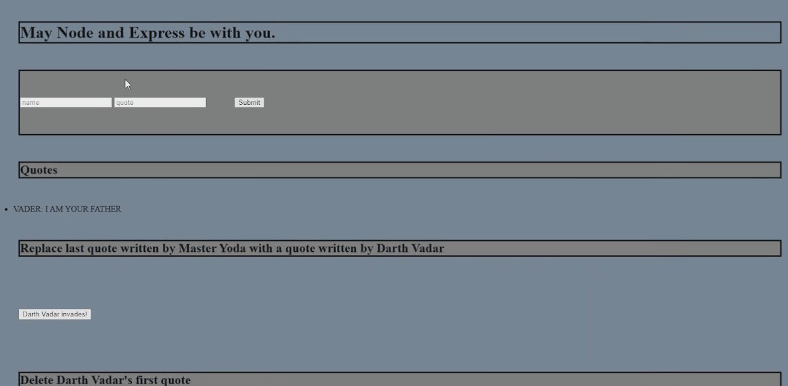

<h3 align="center"> 
Hi, I'm Dominik and I am a full-stack developer, who uses the MERN stack. Being a full-stack developer allows me to not only develop client-facing apps and websites but also develop them with cutting-edge backend support.

I specialize in building beautiful frontend development and I always make sure my backend can do the heavy lifting for your app or website. I love designing code that is light yet powerful, distributed yet synchronized, and beautiful yet effective.
 </h3>

- Want to talk? You can reach me **dominikjo22@gmail.com** or [my website](https://dominikjones.netlify.app/) for more information!

<h1 align="center">Connect</h1>

  
  
  
  
   
  
  

<h1 align="center">Languages and Tools:</h1> 
  

    
    
  
    
    
    
    
    
    
    
     
    

<h1 align="center">Projects</h1>

<table bordercolor="#a3496a">
<tr>
    <td width="50%" valign="top">
      <h3 align="center">Portfolio</h3>
         
        
          
        

          
   
  
        

         
<strong>My portfolio website using HTML, CSS, JavaScript. Check out my site if you need a Software developer or need a website!</strong>

    </td>
     <td width="50%" valign="top">
      <h3 align="center">Fit Friends(coming soon...)</h3>
         
        
          
        

          
   
  
        

         
<strong>A Fullstack Social Media app using HTML, CSS, JavaScript, React, and MVC.</strong>

    </td>
  </tr>
  <tr>
    <td width="50%" valign="top">
      <h3 align="center">Stock up(coming soon...)</h3>
         
        
          
        

          
   
  
        

         
<strong>A Fullstack E-commers app using HTML, CSS, JavaScript, and React.</strong>

    </td>
     <td width="50%" valign="top">
      <h3 align="center">Ticket Tracker</h3>
         
        
          
        

          
   
  
        

         
<strong>A ticket tracker app using HTML, CSS, JavaScript and EJS.</strong>

    </td>
  </tr>
  <tr>
         <td width="50%" valign="top">
      <h3 align="center">Dont Forget(coming soon...)</h3>
         
        
          
        

          
   
  
        

         
<strong> A TO-DO app using HTML, CSS, JavaScript, EJS, and MVC.</strong>

    </td>
     <td width="100%" valign="top">
      <h3 align="center">Star Wars</h3>
         
        
          
        

          
   
  
        

         
<strong>A Star Wars CRUD APP using HTML, CSS, JavaScript, NODE, Express, and MongoDB.</strong>

    </td>
  </tr>
  <tr>
    <td width="50%" valign="top">
      <h3 align="center">Invincible</h3>
         
        
          
        

          
   
  
        

         
<strong>An Invincible APP using HTML, CSS, JavaScript, OOP and my own API.</strong>

    </td>
     <td width="50%" valign="top">
      <h3 align="center">Project Cosmos</h3>
         
        
          
        

          
   
  
        

         
<strong>My REST API proeject using The NASA database, HTML, CSS, JavaScript.</strong>

    </td>
  </tr>
</table>

&nbsp;

